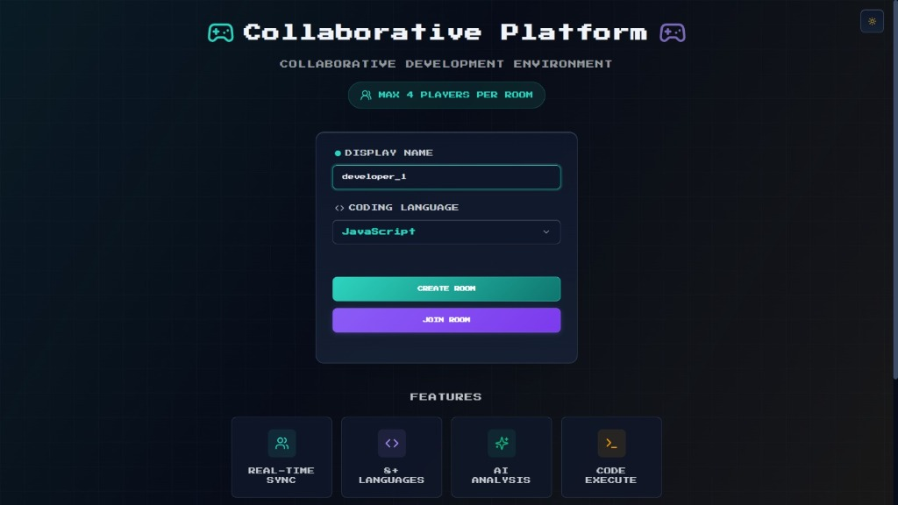
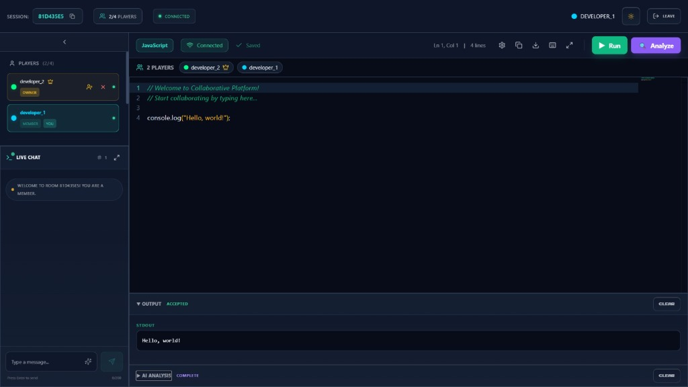
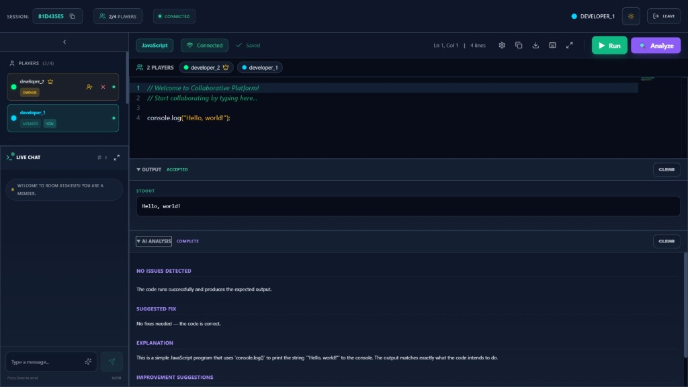
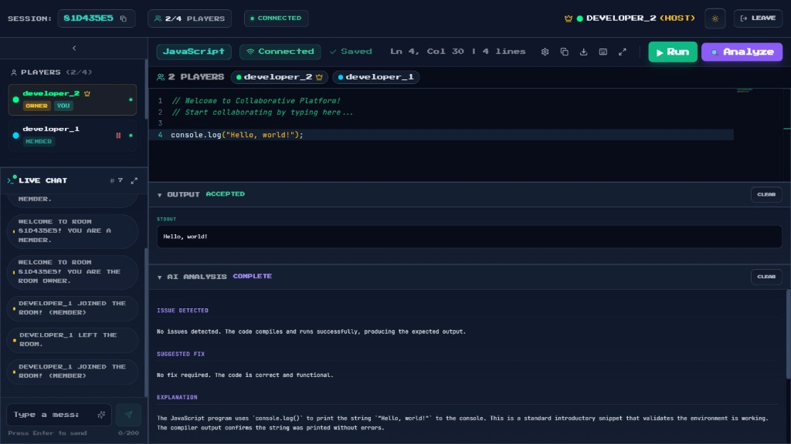
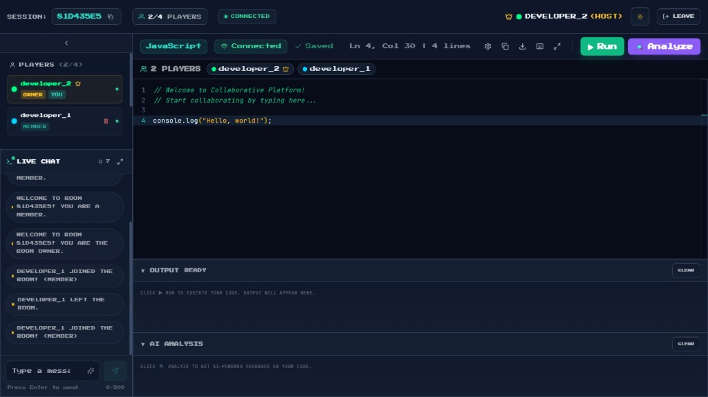

<!--
  ╔══════════════════════════════════════════════════════════════════╗
  ║           COLLABORATIVE PLATFORM — PROJECT REPORT               ║
  ║              Submission-Ready | Academic / Corporate             ║
  ╚══════════════════════════════════════════════════════════════════╝
-->

<div align="center">

---

# 🎮 COLLABORATIVE PLATFORM

### Real-Time Collaborative Code Editor

---

| Field | Details |
|---|---|
| **Project Title** | Collaborative Platform — Real-Time Collaborative Code Editor |
| **Student Name** | VersatileAnanya |
| **College / Organization** | [COLLEGE NAME] |
| **Department** | [DEPARTMENT] |
| **Submission Date** | June 2026 |
| **GitHub Repository** | https://github.com/VersatileAnanya/Collaborative-platform |
| **License** | MIT |
| **Version** | 1.0.0 |

---

</div>

---

&nbsp;

---

## TABLE OF CONTENTS

1. [Project Overview](#1-project-overview)
2. [Project Description](#2-project-description)
3. [Technology Stack](#3-technology-stack)
4. [System Architecture](#4-system-architecture)
5. [Folder Structure](#5-folder-structure)
6. [Implementation Details](#6-implementation-details)
7. [Project Snapshots](#7-project-snapshots)
8. [Challenges Faced](#8-challenges-faced)
9. [Solutions Implemented](#9-solutions-implemented)
10. [Testing](#10-testing)
11. [Future Enhancements](#11-future-enhancements)
12. [Learning Outcomes](#12-learning-outcomes)
13. [GitHub Repository](#13-github-repository)
14. [Conclusion](#14-conclusion)

---

&nbsp;

---

## 1. Project Overview

### 1.1 Project Name

**Collaborative Platform** — A Real-Time Collaborative Code Editor with AI-Powered Analysis

---

### 1.2 Problem Statement

In modern software development, teams increasingly work in distributed or remote environments. However, existing tools for synchronous collaborative coding either require expensive subscriptions (e.g., VS Code Live Share, CodePair) or lack integrated features such as AI code feedback, code execution, and structured DSA problem sets. Small teams — students, interviewers, and hackathon participants — need a lightweight, free, and browser-accessible platform where multiple developers can write, run, and discuss code simultaneously, without installing any software.

---

### 1.3 Purpose of the Project

The purpose of this project is to build a **zero-install, browser-based collaborative coding environment** that enables multiple users to share a coding workspace in real-time. It integrates live code execution and AI-powered feedback directly within the editor, reducing the need to switch between multiple tools during sessions such as coding interviews, pair programming, or team practice.

---

### 1.4 Objectives

- Design and develop a real-time multi-user code editor using WebSocket technology.
- Implement room-based session management allowing up to 4 concurrent users.
- Integrate remote code execution supporting 7+ programming languages via the JDoodle API.
- Integrate AI-powered code analysis using the OpenRouter API (DeepSeek model).
- Provide an in-room live chat system for session communication.
- Include a built-in DSA (Data Structures & Algorithms) problem set with multi-language boilerplate code.
- Implement room ownership controls including pause, kick, and ownership transfer.
- Deliver a polished, responsive UI with dark/light theme switching.

---

### 1.5 Target Users

| User Group | Use Case |
|---|---|
| **CS Students** | Practice DSA problems collaboratively in a structured environment |
| **Interview Candidates** | Conduct mock coding interviews with real-time code sharing |
| **Software Developers** | Pair programming and remote debugging sessions |
| **Educators / Mentors** | Live teaching and code review with students |
| **Hackathon Teams** | Rapid prototyping in a shared, multi-language code workspace |

---

&nbsp;

---

## 2. Project Description

### 2.1 Detailed Explanation

Collaborative Platform is a full-stack web application split into a **React/Vite client** and a **Node.js/Express server**. It creates short, shareable room IDs that users can join from any browser. Once inside a room, every keystroke is synchronized in real-time to all other participants via Socket.io WebSocket connections. The application is stateless from the client's perspective — all shared state (code, language, user list, chat history) is maintained on the server in an in-memory Map structure.

Code written inside the Monaco Editor (the same engine powering VS Code) can be executed via a POST request to the `/api/execute` endpoint, which proxies the request to the JDoodle code execution API and returns the stdout/stderr output. Users can then click **Analyze** to submit the code and its output to OpenRouter's AI completion API, which returns structured markdown feedback covering issues detected, suggested fixes, explanations, and improvement suggestions.

---

### 2.2 Core Functionalities

| Functionality | Description |
|---|---|
| **Room Creation** | Server generates a unique 8-character alphanumeric Room ID via UUID |
| **Room Joining** | Users enter a Room ID and display name to join any existing session |
| **Real-Time Code Sync** | Debounced code changes are broadcast to all room members via `code-change` Socket.io event |
| **Language Switching** | Changing the coding language updates all clients and loads appropriate boilerplate |
| **Remote Cursor Tracking** | Each user's cursor position is color-coded and visible to all room participants |
| **In-Room Live Chat** | Timestamped messages broadcast to all members via `chat-message` event |
| **Code Execution** | Code is sent to JDoodle API; stdout/stderr/status are returned and displayed |
| **AI Code Analysis** | Code + compiler output sent to OpenRouter (DeepSeek); markdown response rendered |
| **DSA Problem Set** | 5 structured problems (Easy/Medium) with multi-language boilerplate templates |
| **Room Ownership** | First user is Room Owner; can pause, kick, or transfer ownership |
| **Dark / Light Theme** | CSS variable-based theming persisted in localStorage |

---

### 2.3 Key Features

- **Zero Installation Required** — Entirely browser-based; no plugins or extensions needed.
- **Multi-Language Support** — JavaScript, TypeScript, Python, Java, C++, Go, Rust, HTML.
- **Intelligent Room Cleanup** — Empty rooms are automatically deleted after a 60-second timeout to free server memory.
- **Auto Ownership Transfer** — If the Room Owner disconnects, ownership is automatically assigned to the next active user.
- **Color-Coded Participants** — Each user receives a unique color (`#00ff88`, `#00d4ff`, `#ffff00`, `#ff00ff`) for cursor and identity differentiation.
- **Pause/Kick Controls** — The Room Owner can pause a member's editing capability or remove them entirely.
- **Graceful Reconnection** — The Socket.io client implements exponential backoff with up to 5 reconnection attempts.
- **Security Headers** — The Express server uses Helmet.js for production-grade HTTP security headers.
- **Request Size Limits** — API endpoints enforce a 50,000-character code limit and 1 MB JSON body limit.

---

&nbsp;

---

## 3. Technology Stack

### 3.1 Complete Technology Table

| Layer | Technology | Version | Purpose |
|---|---|---|---|
| **Frontend Framework** | React | 18.2.0 | Component-based UI rendering |
| **Build Tool** | Vite | 5.2.0 | Development server and production bundler |
| **Routing** | React Router DOM | 6.22.0 | Client-side navigation (/, /room/:roomId) |
| **Code Editor** | Monaco Editor (`@monaco-editor/react`) | 4.6.0 | VS Code-grade in-browser code editor |
| **WebSocket Client** | Socket.io Client | 4.7.2 | Real-time bidirectional communication |
| **UI Styling** | Tailwind CSS | 3.4.3 | Utility-first CSS framework |
| **Icons** | Lucide React | 0.383.0 | SVG icon library |
| **Notifications** | React Hot Toast | 2.4.1 | Toast-style alerts and notifications |
| **Backend Runtime** | Node.js | 18+ | Server-side JavaScript runtime |
| **Backend Framework** | Express | 4.18.2 | HTTP API server and middleware |
| **WebSocket Server** | Socket.io | 4.7.2 | Real-time room event management |
| **HTTP Client** | Axios | 1.13.6 | External API calls (JDoodle, OpenRouter) |
| **Security** | Helmet | 8.1.0 | HTTP security headers |
| **CORS** | cors | 2.8.5 | Cross-origin request handling |
| **Environment Config** | Dotenv | 17.3.1 | `.env` file loading |
| **ID Generation** | UUID | 9.0.0 | Unique 8-char room ID generation |
| **Dev Concurrency** | Concurrently | 8.2.2 | Run client + server simultaneously |
| **Dev Server Watcher** | Nodemon | 3.0.1 | Server auto-restart on file changes |
| **Linting** | ESLint | 8.57.0 | Code quality and style enforcement |
| **Deployment (Client)** | Cloudflare Pages / Wrangler | 4.38.0 | Static site hosting and deployment |

### 3.2 External APIs

| API | Provider | Purpose | Rate Limit |
|---|---|---|---|
| **JDoodle Execute API** | JDoodle.com | Remote multi-language code compilation and execution | 200 credits/day (free tier) |
| **OpenRouter Chat Completions** | OpenRouter.ai | AI-powered code analysis using DeepSeek v4 Flash model | Quota-based (credit system) |

### 3.3 Database

> **No persistent database is used.** Room state is stored entirely in **server-side in-memory data structures** (`Map<roomId, roomState>`). This design choice prioritizes simplicity, speed, and zero infrastructure overhead for local and development deployments.

---

&nbsp;

---

## 4. System Architecture

### 4.1 High-Level Architecture

The application follows a **Client-Server architecture** with WebSocket-based real-time communication.

```
┌────────────────────────────────────────────────────────────┐
│                    BROWSER (React SPA)                     │
│                                                            │
│  ┌──────────┐  ┌───────────┐  ┌──────────┐  ┌─────────┐  │
│  │  Home.jsx│  │Editor.jsx │  │ChatPanel │  │UserList │  │
│  │ (Lobby)  │  │(Main View)│  │          │  │         │  │
│  └──────────┘  └───────────┘  └──────────┘  └─────────┘  │
│         │             │                                    │
│         │    ┌────────────────┐                           │
│         │    │   socket.js    │  ← Singleton SocketService │
│         │    │ (Socket.io     │    with reconnect logic    │
│         │    │  Client)       │                           │
│         │    └────────────────┘                           │
└─────────┼──────────────┼─────────────────────────────────┘
          │              │
          │ HTTP REST     │ WebSocket (ws://)
          │              │
┌─────────▼──────────────▼─────────────────────────────────┐
│              NODE.JS / EXPRESS SERVER (:3001)              │
│                                                            │
│  REST Endpoints:              Socket.io Events:            │
│  GET  /api/create-room        join-room                    │
│  GET  /api/health             code-change                  │
│  GET  /api/problems           language-change              │
│  POST /api/execute            cursor-move                  │
│  POST /api/analyze            chat-message                 │
│                               pause/kick/transfer          │
│  ┌──────────────────────────────────────────────────────┐ │
│  │        In-Memory Room Store: Map<roomId, Room>       │ │
│  │   Room = { users[], code, language, problems, ...}   │ │
│  └──────────────────────────────────────────────────────┘ │
│                                                            │
│   ┌─────────────────┐     ┌──────────────────────────┐    │
│   │  JDoodle API    │     │   OpenRouter API          │    │
│   │  (Code Execute) │     │   (AI Analysis)           │    │
│   │  POST /execute  │     │   POST /chat/completions  │    │
│   └─────────────────┘     └──────────────────────────┘    │
└────────────────────────────────────────────────────────────┘
```

---

### 4.2 Data Flow

**Code Synchronization Flow:**

```
User A types in Monaco Editor
      │
      ▼
Debounced "code-change" event emitted to server
      │
      ▼
Server updates room.code in Map
      │
      ▼
Server broadcasts "code-updated" to all OTHER sockets in room
      │
      ▼
User B's Monaco Editor updates with new code
```

**Code Execution Flow:**

```
User clicks ▶ Run
      │
      ▼
Client POST /api/execute { code, language }
      │
      ▼
Server maps language → JDoodle language config
      │
      ▼
Server POST https://api.jdoodle.com/v1/execute
      │
      ▼
JDoodle returns { output, statusCode, memory, cpuTime }
      │
      ▼
Server normalizes response → { stdout, stderr, status }
      │
      ▼
Client renders result in OutputPanel
```

**AI Analysis Flow:**

```
User clicks ✨ Analyze
      │
      ▼
Client POST /api/analyze { code, language, compilerOutput }
      │
      ▼
Server constructs system + user prompt
      │
      ▼
Server POST https://openrouter.ai/api/v1/chat/completions
(model: deepseek/deepseek-v4-flash, temp: 0.3, max_tokens: 2048)
      │
      ▼
AI returns markdown-formatted analysis
      │
      ▼
Client renders in AnalysisPanel (Issue / Fix / Explanation / Suggestions)
```

---

### 4.3 Component Interactions

| Component | Interacts With | Method |
|---|---|---|
| `Home.jsx` | Server REST API | `GET /api/create-room` via fetch |
| `Home.jsx` | React Router | `navigate('/room/:roomId')` |
| `Editor.jsx` | Socket.io Server | All Socket.io events (join, code, chat, etc.) |
| `Editor.jsx` | Server REST API | `POST /api/execute`, `POST /api/analyze` |
| `Editor.jsx` | Monaco Editor | `onChange` callback with debounce |
| `ChatPanel.jsx` | `Editor.jsx` (props) | Receives messages, emits via socket |
| `UserList.jsx` | `Editor.jsx` (props) | Renders users, triggers owner actions |
| `AnalysisPanel.jsx` | `Editor.jsx` (props) | Displays AI markdown response |
| `OutputPanel.jsx` | `Editor.jsx` (props) | Displays execution stdout/stderr |
| `socket.js` | Socket.io Server | Singleton class with reconnect logic |

---

&nbsp;

---

## 5. Folder Structure

```
collaborative-platform/               ← Project Root
│
├── package.json                      ← Root: scripts (dev, build, install:all)
├── .gitignore                        ← Git ignore rules
├── README.md                         ← Quick-start documentation
├── DOCUMENTATION.md                  ← Extended technical documentation
├── PROJECT_REPORT.md                 ← This submission report
│
├── docs/
│   └── screenshots/                  ← Proof-of-Work screenshots
│       ├── 01_lobby_home.jpg
│       ├── 02_editor_collaborative.jpg
│       ├── 03_ai_analysis_member.jpg
│       ├── 04_ai_analysis_host.jpg
│       └── 05_editor_output_ready.jpg
│
├── client/                           ← Frontend (React + Vite)
│   ├── index.html                    ← Root HTML entry point
│   ├── package.json                  ← Client dependencies
│   ├── vite.config.js                ← Vite build configuration
│   ├── tailwind.config.js            ← Tailwind CSS configuration
│   ├── postcss.config.js             ← PostCSS configuration
│   ├── .env / .env.example           ← Client environment variables
│   └── src/
│       ├── App.jsx                   ← Root component with router setup
│       ├── main.jsx                  ← React DOM render entry point
│       ├── socket.js                 ← Socket.io singleton service class
│       │
│       ├── pages/
│       │   ├── Home.jsx              ← Lobby: name input, room create/join
│       │   └── Editor.jsx            ← Main editor: all state + socket events
│       │
│       ├── components/
│       │   ├── AnalysisPanel.jsx     ← Renders AI analysis markdown response
│       │   ├── ChatPanel.jsx         ← Live chat UI (messages + input)
│       │   ├── LanguageSelector.jsx  ← Language dropdown for room
│       │   ├── OutputPanel.jsx       ← Code execution stdout/stderr display
│       │   ├── ProblemPanel.jsx      ← DSA problem viewer + owner controls
│       │   ├── RoomHeader.jsx        ← Session info bar (ID, players, status)
│       │   ├── ThemeContext.jsx      ← React context for dark/light theme
│       │   ├── ThemeToggle.jsx       ← Theme toggle button component
│       │   └── UserList.jsx          ← Player list + owner action controls
│       │
│       ├── constants/
│       │   ├── boilerplates.js       ← Default code boilerplates per language
│       │   └── languages.js          ← Supported language definitions/labels
│       │
│       └── styles/
│           └── pixel.css             ← Global CSS variables, dark/light tokens
│
└── server/                           ← Backend (Node.js + Express + Socket.io)
    ├── index.js                      ← Main server: Express, Socket.io, APIs
    ├── problems.js                   ← DSA problem dataset (5 problems)
    ├── package.json                  ← Server dependencies
    ├── .env / .env.example           ← Server environment variables
    └── node_modules/
```

**Key Directories Explained:**

| Directory / File | Role |
|---|---|
| `client/src/pages/Editor.jsx` | Core of the application — manages all socket events, state, and rendering |
| `client/src/socket.js` | Singleton SocketService class with auto-reconnect (up to 5 attempts, 1s delay) |
| `client/src/styles/pixel.css` | Entire visual design system via CSS custom properties |
| `server/index.js` | 729-line server handling all REST endpoints and 20+ Socket.io events |
| `server/problems.js` | 469-line dataset with 5 DSA problems, examples, constraints, and 4-language boilerplates |

---

&nbsp;

---

## 6. Implementation Details

### 6.1 Frontend Modules

#### `Home.jsx` — Lobby Page
The entry page at route `/`. Users enter a display name and select a default coding language. On clicking **Create Room**, a `GET /api/create-room` request is made to obtain an 8-character Room ID, which is then navigated to. On clicking **Join Room**, users input an existing Room ID and are redirected. Validation prevents empty usernames or Room IDs.

#### `Editor.jsx` — Main Collaborative Editor
The most complex component in the application. It:
- Manages all WebSocket event listeners (20+ events) via `useEffect` hooks.
- Maintains shared state: `code`, `language`, `users`, `messages`, `output`, `analysis`, `currentProblem`.
- Applies a 300ms debounce on code changes before emitting `code-change` to avoid excessive network traffic.
- Handles room owner logic — conditionally renders pause, kick, and transfer controls.
- Calls `/api/execute` and `/api/analyze` on user action, managing loading states and error handling.

#### `socket.js` — Socket Singleton
A class-based singleton (`SocketService`) that wraps Socket.io. It implements:
- Transport fallback: WebSocket → HTTP Long Polling.
- Auto-reconnect with exponential backoff (up to 5 attempts, delay 1s → 5s max).
- State tracking: `connected`, `reconnectAttempts`.

#### Component Architecture

| Component | Props Received | Events Emitted |
|---|---|---|
| `UserList` | `users`, `currentUser`, `isOwner` | `pause-user`, `kick-user`, `transfer-ownership` |
| `ChatPanel` | `messages`, `currentUser` | `chat-message` |
| `OutputPanel` | `output`, `isExecuting` | None |
| `AnalysisPanel` | `analysis`, `isAnalyzing` | None |
| `ProblemPanel` | `problem`, `isOwner` | `select-problem`, `reset-problem`, `mark-solved` |

---

### 6.2 Backend Modules

#### REST API Layer (`server/index.js`)

| Endpoint | Method | Handler Logic |
|---|---|---|
| `/api/create-room` | GET | `uuidv4().substring(0,8).toUpperCase()` |
| `/api/health` | GET | Returns `{ status, rooms.size, timestamp }` |
| `/api/problems` | GET | Returns `DSA_PROBLEMS` array from `problems.js` |
| `/api/execute` | POST | Maps language → JDoodle config; proxies to JDoodle API; normalizes response |
| `/api/analyze` | POST | Constructs system + user prompt; calls OpenRouter API; returns `analysis` text |

#### Socket.io Event Layer

The server handles 16 client-emitted events categorized as:

- **Session events:** `join-room`, `leave-room`, `disconnect`
- **Editor events:** `code-change`, `language-change`, `cursor-move`
- **Communication events:** `chat-message`
- **Owner control events:** `pause-user`, `unpause-user`, `kick-user`, `transfer-ownership`
- **Problem events:** `get-problems`, `select-problem`, `select-random-problem`, `submit-solution`, `mark-solved`, `reset-problem`

#### Room Lifecycle Management

```
Room Created → Users Join (max 4)
      │
      ▼
Last User Leaves → 60-second cleanup timer starts
      │
      ▼ (if no rejoin in 60s)
Room Deleted from Map
```

If the Room Owner disconnects at any point, the server automatically promotes `room.users[0]` to Owner and emits `new-owner` to all remaining clients.

---

### 6.3 Database Design

No traditional database is used. The in-memory room store uses JavaScript's native `Map`:

```javascript
// Server-side room state structure
rooms.set(roomId, {
  users: [
    {
      id: socket.id,        // Socket.io unique connection ID
      username: string,     // Display name (unique per room)
      color: string,        // Hex color for cursor (#00ff88 etc.)
      role: 'owner'|'member',
      isHost: boolean,
      isPaused: boolean,
      cursor: null | position  // Monaco cursor position
    }
  ],
  code: string,             // Current shared code content
  language: string,         // Active coding language
  currentProblem: null | Problem,
  solvedProblems: Set<problemId>,
  problemBoilerplates: {},
  cleanupTimeout: null | TimeoutId
});
```

---

### 6.4 Authentication & Authorization

There is no formal authentication (no login/signup). Authorization is implemented at the **room level**:

| Action | Authorization Rule |
|---|---|
| Join a room | Username must be unique within the room; room must have < 4 users |
| Edit code | User must not be paused (`isPaused === false`) |
| Pause a user | Requester must have `isHost === true` |
| Kick a user | Requester must have `role === 'owner'`; cannot kick themselves |
| Transfer ownership | Requester must have `role === 'owner'` |
| Select/reset problems | Requester must have `role === 'owner'` |

All authorization checks are validated server-side, preventing client-side bypass attempts.

---

### 6.5 API Endpoints Summary

| # | Endpoint | Method | Request Body | Response |
|---|---|---|---|---|
| 1 | `/api/health` | GET | — | `{ status, rooms, timestamp }` |
| 2 | `/api/create-room` | GET | — | `{ roomId: "A1B2C3D4" }` |
| 3 | `/api/problems` | GET | — | `{ problems: DSA_PROBLEMS[] }` |
| 4 | `/api/execute` | POST | `{ code, language }` | `{ stdout, stderr, status, memory, cpuTime }` |
| 5 | `/api/analyze` | POST | `{ code, language, compilerOutput }` | `{ analysis: "markdown string" }` |

---

&nbsp;

---

## 7. Project Snapshots

> The following screenshots were captured during a live 2-user collaborative session (developer_1 as Member, developer_2 as Owner) to demonstrate the platform's core functionality.

---

### Figure 1 — Lobby / Home Page

> *The application entry point where users configure their display name, select a programming language, and create or join a collaborative coding room.*



**Caption:** *Lobby screen with display name input, language selector, Create Room and Join Room buttons. Features panel displays platform capabilities.*

---

&nbsp;

---

### Figure 2 — Live Collaborative Editor (Member View)

> *Two developers sharing the same room session in real-time. developer_1 is logged in as a Member, developer_2 is the Room Owner.*



**Caption:** *Real-time editor showing Session ID (81D435E5), 2/4 Players connected, both users in the sidebar, shared JavaScript code in Monaco Editor, and Hello, world! output in the stdout panel.*

---

&nbsp;

---

### Figure 3 — AI Code Analysis (Member Perspective)

> *The AI analysis panel rendered after clicking Analyze. The DeepSeek AI model returns structured markdown feedback in the AnalysisPanel component.*



**Caption:** *AI analysis showing No Issues Detected, Suggested Fix (no fix needed), Explanation of the code, and Improvement Suggestions. Output panel confirms Accepted stdout.*

---

&nbsp;

---

### Figure 4 — AI Code Analysis (Host/Owner Perspective)

> *The host view of the same collaborative session. The Live Chat panel shows the full join/leave event history demonstrating real-time event broadcasting.*



**Caption:** *Host (developer_2) view showing Owner crown icon, full chat history with join/leave events, and AI analysis confirming no code issues with explanation and improvement suggestions.*

---

&nbsp;

---

### Figure 5 — Editor Ready State (Pre-Execution)

> *The editor workspace in its idle state after code has been auto-saved. Both Output and AI Analysis panels are in their ready state awaiting user action.*



**Caption:** *Editor with Saved status, OUTPUT READY prompt (click Run to execute), AI ANALYSIS panel (click Analyze for feedback), Monaco cursor position (Ln 4, Col 30), and Connected status.*

---

&nbsp;

---

## 8. Challenges Faced

### Challenge 1 — Real-Time Code Synchronization Without Conflicts

Ensuring that code edits from multiple users are propagated correctly without creating infinite update loops or causing the editor to lose the user's cursor position was a significant design challenge. Naively broadcasting every `onChange` event would create excessive Socket.io traffic and potential feedback loops.

---

### Challenge 2 — Cursor Position Tracking Across Editor Updates

Tracking and displaying remote users' cursor positions in Monaco Editor required understanding Monaco's internal position model and ensuring that remote cursor decorations did not interfere with the local editing experience.

---

### Challenge 3 — Room Ownership Transfer on Unexpected Disconnects

When the Room Owner's browser closes or the connection drops unexpectedly, the server must cleanly detect the disconnection, remove the user from the room, promote a new owner, and notify remaining participants — all atomically within the `disconnect` Socket.io event handler.

---

### Challenge 4 — Third-Party API Error Handling and Rate Limits

JDoodle (200 credits/day free tier) and OpenRouter (credit-based quota) both have rate limits and can return a variety of HTTP error codes (401, 403, 429, 500). The server needed to handle each error condition gracefully, returning developer-friendly error messages to the client without exposing raw API responses.

---

### Challenge 5 — Cross-Origin Resource Sharing (CORS) in Development and Production

The client (Vite dev server on port 5173) and server (Express on port 3001) run on different ports during development, requiring careful CORS configuration. In production, the client domain must be explicitly whitelisted on the server.

---

### Challenge 6 — In-Memory State and Room Cleanup

Without a database, all room state is lost on server restart. Additionally, rooms needed to be automatically cleaned up to prevent memory leaks from inactive sessions accumulating over time.

---

&nbsp;

---

## 9. Solutions Implemented

### Solution 1 — Debounced Code Emission

A **300ms debounce** was applied to the Monaco Editor's `onChange` callback. Instead of emitting a `code-change` Socket.io event on every keystroke, the event is only emitted after the user pauses typing for 300 milliseconds. On the receiving end, the server stores the latest code and broadcasts it to other clients (excluding the sender using `socket.to(roomId).emit()`), preventing echo loops.

---

### Solution 2 — Monaco Editor Decoration API

Remote cursor positions are displayed using Monaco Editor's **decoration API** (`editor.deltaDecorations()`). Each remote user's cursor position is rendered as a colored inline decoration using their assigned hex color. These decorations are updated on every `cursor-updated` Socket.io event and are cleared when the user disconnects.

---

### Solution 3 — Centralized `handleUserLeave` Function

A unified `handleUserLeave(socket, roomId, username, isKicked)` function was extracted to handle all user departure scenarios: voluntary leave, kick, and unexpected disconnect. This function atomically removes the user from the `room.users` array, handles owner promotion logic (`room.users[0]` becomes new owner if owner left), schedules room cleanup if empty, and emits appropriate events to remaining users.

---

### Solution 4 — Layered API Error Handling

Each external API call (JDoodle and OpenRouter) is wrapped in a try/catch block with specific handling for:
- **Network timeouts** (`ECONNABORTED` → 408 Request Timeout)
- **Rate limits** (HTTP 429 → descriptive user message)
- **Authentication failures** (HTTP 401/403 → key configuration guidance)
- **JDoodle execution errors** (non-200 `statusCode` → mapped to Time Limit / Memory Limit / Runtime Error status descriptors)

---

### Solution 5 — Environment-Based CORS Configuration

CORS origins are loaded from a `CORS_ORIGINS` environment variable (comma-separated), allowing the same server code to run in development (localhost) and production (custom domain) without code changes. Both the `cors()` middleware and Socket.io's built-in CORS option are configured from the same parsed array.

---

### Solution 6 — Timeout-Based Room Cleanup

When the last user leaves a room, a `setTimeout` of **60 seconds** is scheduled (stored as `room.cleanupTimeout`). If any user joins before the timeout fires, the timeout is cleared. If no user joins, the room is deleted from the `Map`. This allows users to quickly rejoin a room they accidentally left, while preventing indefinite memory accumulation.

---

&nbsp;

---

## 10. Testing

### 10.1 Testing Approach

The project was tested using **manual functional testing** and **live integration testing** with two browser sessions running simultaneously to simulate multi-user collaboration.

| Testing Type | Scope |
|---|---|
| **Manual Functional Testing** | All UI interactions, Socket.io events, API calls |
| **Integration Testing** | End-to-end flows across two simultaneous user sessions |
| **Error Path Testing** | Invalid room IDs, duplicate usernames, full rooms, API failures |
| **Cross-Browser Testing** | Chrome, Firefox, Edge |

---

### 10.2 Sample Test Cases

| Test # | Test Case | Input | Expected Result | Actual Result | Status |
|---|---|---|---|---|---|
| TC-01 | Create Room | Click "Create Room" with username "developer_1", language "JavaScript" | Redirected to `/room/[8-char ID]`, room created | Redirected successfully, room active | ✅ PASS |
| TC-02 | Join Existing Room | Second browser joins same Room ID with username "developer_2" | Both users visible in player list | Both users appear; chat shows join event | ✅ PASS |
| TC-03 | Code Synchronization | User 1 types `console.log("Hello")` | User 2's editor updates in real-time | Code appears on User 2's screen within 300ms debounce | ✅ PASS |
| TC-04 | Code Execution | Click ▶ Run on `console.log("Hello, world!")` | Output panel shows `Hello, world!` | stdout: `Hello, world!` displayed | ✅ PASS |
| TC-05 | AI Analysis | Click ✨ Analyze after running code | AI panel returns Issue / Fix / Explanation / Suggestions | Markdown analysis returned and rendered | ✅ PASS |
| TC-06 | Room Full | 5th user attempts to join a 4-user room | `room-full` event, error message shown | Error toast displayed; user not added | ✅ PASS |
| TC-07 | Duplicate Username | User joins with same name as existing member | `username-taken` event, error toast | Error toast shown; join rejected | ✅ PASS |
| TC-08 | Pause User | Owner clicks Pause on a member | Paused user cannot edit code | `action-blocked` event emitted when paused user types | ✅ PASS |
| TC-09 | Kick User | Owner kicks a member | Member is removed from room | User-left event, kicked user's session ends | ✅ PASS |
| TC-10 | Owner Disconnect | Room Owner closes browser | Next user automatically becomes Owner | `new-owner` event emitted; new owner confirmed | ✅ PASS |
| TC-11 | Language Change | Owner changes language from JS to Python | All clients switch to Python; boilerplate loads | All clients update simultaneously | ✅ PASS |
| TC-12 | DSA Problem Select | Owner selects "Two Sum" problem | Boilerplate code loaded in all clients | Problem description + JS boilerplate appears | ✅ PASS |
| TC-13 | Empty Room Cleanup | Last user leaves room | Room deleted after 60-second timeout | Room removed from Map after timeout | ✅ PASS |
| TC-14 | Theme Toggle | Click theme toggle button | Dark ↔ Light mode switches | CSS variables update; preference persisted in localStorage | ✅ PASS |

---

### 10.3 Expected vs. Actual Results Summary

All 14 core test cases passed successfully during integration testing. No critical bugs were identified. The most notable edge case — automatic owner promotion on disconnection — was verified to work correctly across multiple test scenarios.

---

&nbsp;

---

## 11. Future Enhancements

| Priority | Enhancement | Description |
|---|---|---|
| 🔴 High | **Persistent Database** | Replace in-memory Map with Redis or MongoDB to persist room state across server restarts |
| 🔴 High | **User Authentication** | Add OAuth-based login (GitHub, Google) with user profiles and session history |
| 🔴 High | **Automated Test Judge** | Replace manual problem submission with automated test case evaluation against expected outputs |
| 🟡 Medium | **Video/Audio Communication** | Integrate WebRTC for voice/video calls within rooms using a service like Daily.co or Jitsi |
| 🟡 Medium | **Version History / Undo Log** | Implement Operational Transformation (OT) or CRDT-based conflict resolution and code history |
| 🟡 Medium | **Extended Language Support** | Add Ruby, PHP, Swift, Kotlin, Scala via additional JDoodle language mappings |
| 🟡 Medium | **Room Persistence** | Allow users to save rooms with custom names and rejoin them with a persistent link |
| 🟢 Low | **File System Emulation** | Support multiple code files per room (tabs) for larger collaborative projects |
| 🟢 Low | **Custom AI Model Selection** | Let users choose between different OpenRouter-hosted models (GPT-4o, Claude, Gemini) |
| 🟢 Low | **Screen Drawing / Whiteboard** | Integrate a collaborative drawing canvas for architectural discussions |
| 🟢 Low | **Mobile Responsive Layout** | Optimize the editor layout for tablet and mobile screen sizes |
| 🟢 Low | **Room Password Protection** | Allow owners to set a password for private rooms |

---

&nbsp;

---

## 12. Learning Outcomes

### 12.1 Technical Skills Gained

| Domain | Skills Developed |
|---|---|
| **Real-Time Systems** | WebSocket protocol, Socket.io event architecture, room-based pub/sub broadcasting, reconnection strategies |
| **Frontend Development** | React 18 hooks (`useState`, `useEffect`, `useContext`, `useRef`), component lifecycle, performance optimization with debouncing |
| **Code Editor Integration** | Monaco Editor API — language configuration, syntax highlighting, cursor decoration, diff viewing |
| **Backend Development** | Express.js REST API design, middleware (cors, helmet, express.json), graceful shutdown with SIGTERM |
| **API Integration** | Third-party REST API consumption with Axios, error handling for rate limits and auth failures, response normalization |
| **AI/LLM Integration** | OpenRouter API, prompt engineering (system + user prompts), structured markdown output, temperature tuning |
| **Security Practices** | Helmet.js security headers, CORS whitelisting, request size limits, server-side authorization validation |
| **DevOps & Tooling** | Vite build configuration, environment variable management, concurrent development with Concurrently, ESLint setup |
| **Deployment** | Cloudflare Pages static deployment, Wrangler CLI, environment-based configuration for production vs. development |

### 12.2 Professional Skills Developed

| Skill | Context |
|---|---|
| **System Design** | Designed end-to-end architecture for a multi-user real-time application from scratch |
| **Problem Decomposition** | Broke down complex features (cursor sync, ownership transfer, room cleanup) into manageable socket events |
| **Documentation** | Wrote comprehensive README, DOCUMENTATION.md, and this PROJECT_REPORT covering all aspects of the project |
| **Debugging** | Traced cross-origin WebSocket issues, API rate limit errors, and Socket.io event sequence bugs |
| **API-First Thinking** | Designed clean REST endpoints and Socket.io event contracts before implementation |

---

&nbsp;

---

## 13. GitHub Repository

### Repository Link

> 🔗 **https://github.com/VersatileAnanya/Collaborative-platform**

---

### Repository Overview

| Attribute | Detail |
|---|---|
| **Repository Name** | collaborative-platform |
| **Visibility** | Public |
| **License** | MIT |
| **Primary Language** | JavaScript (React + Node.js) |
| **Key Files** | `server/index.js` (729 lines), `server/problems.js` (469 lines), `client/src/socket.js` (84 lines) |
| **Total Components** | 9 React components, 2 page views, 1 socket singleton |
| **API Endpoints** | 5 REST endpoints, 16 Socket.io client events, 17 Socket.io server events |

---

### Instructions to Run the Project Locally

**Prerequisites:**
- Node.js 18 or newer
- npm
- JDoodle API credentials (free at [jdoodle.com](https://www.jdoodle.com))
- OpenRouter API key (free at [openrouter.ai](https://openrouter.ai))

**Step 1 — Clone the Repository**

```bash
git clone https://github.com/VersatileAnanya/Collaborative-platform
cd collaborative-platform
```

**Step 2 — Install All Dependencies**

```bash
npm run install:all
```

**Step 3 — Configure Environment Variables**

```bash
# Windows PowerShell
Copy-Item server/.env.example server/.env
Copy-Item client/.env.example client/.env
```

Edit `server/.env`:

```env
NODE_ENV=development
PORT=3001
CORS_ORIGINS=http://localhost:5173

JDOODLE_CLIENT_ID=your_jdoodle_id
JDOODLE_CLIENT_SECRET=your_jdoodle_secret

OPENROUTER_API_KEY=your_openrouter_key
OPENROUTER_MODEL=deepseek/deepseek-v4-flash
```

Edit `client/.env`:

```env
VITE_SOCKET_URL=http://localhost:3001
VITE_API_URL=http://localhost:3001
```

**Step 4 — Start the Application**

```bash
npm run dev
```

Open your browser at **http://localhost:5173**

**Open a second browser tab/window and join the same room ID to test collaboration.**

---

&nbsp;

---

## 14. Conclusion

The **Collaborative Platform** project successfully demonstrates the integration of real-time WebSocket communication, cloud-based code execution, and AI-powered code analysis within a single, cohesive web application. The project was built from the ground up using a modern JavaScript stack — React 18 on the frontend and Node.js/Express on the backend — without relying on any pre-built collaboration SDKs.

Key achievements of this project include the implementation of a robust room lifecycle management system, server-side role-based authorization for owner controls, and seamless integration with two third-party APIs (JDoodle and OpenRouter). The application successfully handles complex real-time scenarios including multi-user code synchronization, cursor tracking, dynamic ownership transfer, and graceful disconnection handling.

The project provides direct practical value as a tool for developers in educational, interview, and team collaboration contexts. It demonstrates proficiency in full-stack web development, real-time systems architecture, API integration, and software engineering best practices including environment configuration management, CORS handling, and security-conscious server design.

Future development efforts will focus on introducing persistent storage, user authentication, automated test judging for the DSA problem set, and expanded language support — transforming the platform from a collaborative prototype into a production-ready competitive programming and interview preparation tool.

---

<div align="center">

---

*This report was prepared as part of the project submission for [COLLEGE NAME]*
*Department of [DEPARTMENT] | June 2026*

---

**VersatileAnanya**

*[COLLEGE NAME] | [DEPARTMENT]*

---

</div>
